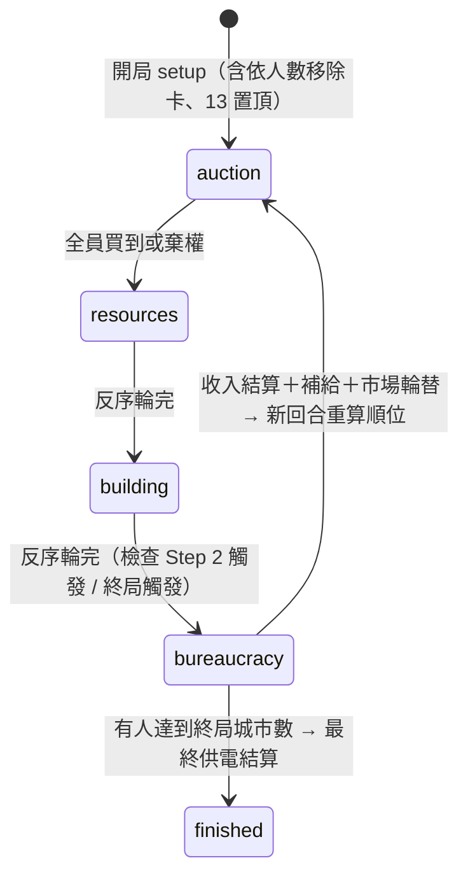

# 核心遊戲引擎設計（M2 Engine Design）

定義後端引擎的架構、狀態結構、回合狀態機與前後端事件協議。規則語意以原版《電力公司》規則書為準，本文件只記「怎麼實作」與「刻意偏離原版之處」。

## 1. 架構總原則

```
┌─────────────────────────── Room GenServer（M3）───────────────────────────┐
│  身份/座位/聊天/計時/廣播   ──呼叫──▶  GridMaster.Engine（M2，純函數）      │
│                                        apply_action(state, player, action) │
│                                        → {:ok, new_state, [event]}         │
│                                        → {:error, reason}                  │
└────────────────────────────────────────────────────────────────────────────┘
```

- **引擎是純函數**：不碰 process、不碰時間、不碰網路。輸入（舊狀態＋動作），輸出（新狀態＋事件清單）或錯誤。`mix test` 可直接測完整牌局。
- **事件（event）是廣播與動畫的素材**：每個成功動作回傳有序事件清單（如 `plant_bought`、`step_changed`），Room 層負責推給前端。
- **隨機性可重現**：洗牌用 `:rand` 顯式 seed，seed 存在 state 裡。同 seed 同動作序列 = 同結果，測試與除錯都靠它。
- **Dijkstra 用純 Elixir**：42 節點的圖毫無效能壓力，不動用 Rustler（PRD 的 Rust 選項保持擱置）。

## 2. State 結構（Elixir struct 草案）

```elixir
%Engine.State{
  # 全域進程
  step: 1,                          # 1 | 2 | 3
  round: 1,
  phase: :auction,                  # :auction | :resources | :building | :bureaucracy | :finished
  phase_state: %Auction{...},       # 各階段的子狀態（見 §4）
  turn_order: ["p1", "p3", "p2"],   # 本回合順位（領先者在前）
  rng: {...},                       # :rand.export_state/0

  # 玩家（key = player_id，由 Room 層給定）
  players: %{
    "p1" => %Player{
      credits: 50,
      plants: [%{number: 13, type: "self", fuel: 0, powers: 1}],  # 最多 3（2人局 4）
      resources: %{hydro: 2, thermal: 0, waste: 0, quantum: 0},    # 玩家層級持有（見 §6.3）
      cities: MapSet.new(["seattle"])
    }
  },

  # 市場
  market: [3, 4, 5, 6, 7, 8, 9, 10],   # 恆保持排序；現行/未來由 step 決定切分（view 層拆給前端）
  deck: [13, 21, ...],              # 牌頂在前；:step3 原子放牌底
  removed: [...],                    # 依人數移除＋淘汰的卡
  resource_market: %{hydro: 24, thermal: 18, waste: 6, quantum: 2},   # 只存數量（見 §6.1）

  # 地圖佔據：city_id → [player_id]（依進場順序，長度 = 已佔 slot 數）
  city_owners: %{"seattle" => ["p1"], ...},
  active_regions: MapSet.new(["nw", "sw", "mw"]),   # 依人數啟用的叢集

  # 結局
  winner: nil                        # 或 %{ranking: [...], powered: %{...}}
}
```

要點：

- **資源市場只存四個整數**。買最便宜、補最貴空格的規則使「已填格永遠是價格階梯的高價端連續區段」，數量即可唯一決定市場面貌。單價階梯：一般資源 `[1,1,1,2,2,2,...,8,8,8]`（24 格），算力 `[1..8,10,12,14,16]`（12 格）。買 k 個的總價 = 階梯上從第 `total - count` 格起取 k 格加總。
- **城市 slot 不存空位**，`city_owners` 的 list 長度就是已佔數；第 n 個進場者付 `city_slot_costs[n]`（$10/15/20）。Step 限制開放上限（Step 1 = 1 人、Step 2 = 2 人、Step 3 = 3 人）。
- **engine 不認識 Discord**，`player_id` 是 Room 層給的不透明字串。

## 3. 回合結構與狀態機

每回合五個階段。「決定順位」不設等待狀態——它是回合開始時的純計算。



- **順位計算**：城市數多者前；平手比手上最大卡號。第 1 回合開局隨機，競標結束後**立即重算**（原版特規）。
- **競標階段**：正序。**買資源與擴建**：反序（PRD §5.1 的反向平衡）。
- **官僚階段**：全員**同時**提交供電選擇，全到齊即結算（無順位意義，省等待）。

### 特殊時點（依原版規則實作）

| 時點 | 規則 |
|---|---|
| Step 2 觸發 | 擴建階段有人達到 `step2_trigger` 城 → 該階段結束時進 Step 2，移除市場最低卡並補牌 |
| Step 3 卡被抽出 | announce＋重洗剩餘牌庫；依抽出階段的原版細則，於當前階段結束後進 Step 3（市場縮為 6 張全可競標） |
| 卡號 ≤ 最大城市數 | 擴建動作後與官僚階段開始時檢查，移除並補牌 |
| 本回合無人買卡 | 官僚階段移除現行市場最低卡 |
| 市場輪替 | Step 1/2：未來市場最高卡收入牌庫底；Step 3：移除最低卡 |
| 終局 | 擴建階段結束時有人 ≥ `game_end` 城 → 進最終官僚結算，**能供電最多城者勝**（平手比餘額，再比城市數） |

## 4. 各階段子狀態與動作

所有動作經 `Engine.apply_action(state, player_id, {action, payload})` 進入；非法動作（不在順位、錢不夠、違反規則）回 `{:error, reason_atom}`，state 不變。

### 4.1 競標 `:auction`

```elixir
%Auction{
  queue: ["p1", "p2"],          # 尚未買到/棄權者（順位序），queue 頭是「提名人」
  bought: %{"p3" => 20},
  bidding: nil | %{
    plant: 20, price: 23, leader: "p2",
    active: ["p1", "p2"],        # 尚未退出此輪競價者（出價順時針輪轉）
  },
  pending_discard: nil | "p2"    # 買超上限者必須先棄一張才能繼續
}
```

| 動作 | 條件 | 效果 |
|---|---|---|
| `auction_choose {plant, bid}` | queue 頭；bid ≥ 卡號 | 開一輪競價 |
| `auction_bid {amount}` | 競價中的 active 玩家；> 現價 | 更新領先者 |
| `auction_fold` | 競價中 | 退出此輪；剩一人 → 成交 |
| `auction_pass` | queue 頭；**第 1 回合禁用** | 本回合退出競標階段 |
| `auction_discard {plant}` | pending_discard 本人 | 棄卡後結束成交流程 |

成交 → 扣款、給卡、補市場重排序；提名人若沒得標可再提名。全員處理完 → `:resources`。

### 4.2 買資源 `:resources`

`%Resources{queue: [...]}`（反序）。輪到者一次提交整批採購：

- `resources_buy %{hydro: 2, thermal: 1, waste: 0, quantum: 0}` — 驗證市場存量、總價、**儲存容量**（§6.3），扣款入庫，輪到下一位。全 0 即棄買。

### 4.3 擴建 `:building`

`%Building{queue: [...]}`（反序）。輪到者可連續動作：

- `build {city}` — 費用 = Dijkstra（自身網路到該城的最低過路費和；首城為 0）＋ 進場 slot 費。驗證叢集啟用、slot 開放、未重複佔據、餘額。
- `build_done` — 結束自己的擴建。

前端即時報價不發動作：state 全量同步後**前端用同一套圖數據自算**（JS 版 Dijkstra，M5 實作）；成交價仍以後端為準。

### 4.4 官僚 `:bureaucracy`

`%Bureaucracy{submitted: %{"p1" => [20, 13]}}`

- `power_submit {plants: [20, 13]}` — 選擇啟動的設施（可空）。驗證資源足夠；hybrid 的水力/火力分配由引擎自動求解（貪婪即可，僅兩種資源）。

全員提交 → 一次結算：扣資源 → 發收入（`payout[min(供電數, 20)]`）→ 市場補給（查表）→ 市場輪替 → 新回合或終局。

## 5. WebSocket 事件協議（Phoenix Channel）

Topic：`room:main`（MVP 單房間；架構天然支援多房）。

### Client → Server

| event | payload | 說明 |
|---|---|---|
| `action` | `{type, payload}` | 遊戲動作，type = §4 的動作名 |
| `seat_take` / `seat_leave` / `ready` / `unready` | `{}` | Lobby 座位（M3） |
| `game_start` | `{}` | 全員 ready 時任一玩家可發 |
| `chat_send` | `{text}` | 聊天（M3） |
| `admin_abort` | `{}` | Admin 掀桌（M3） |

### Server → Client

| event | payload | 說明 |
|---|---|---|
| `state_sync` | 個人化完整狀態 | **每個成功動作後全量推送**（見下） |
| `game_events` | `[{type, payload}]` | 觸發動畫用的有序事件流，與 state_sync 同時發 |
| `action_error` | `{reason}` | 僅回給動作發起者 |
| `chat_new` / `presence_diff` | … | M3 |

**全量同步而非 patch**：狀態就幾 KB、至多 6 人，每動作全量推送把「前端狀態永遠正確」變成結構性保證，MVP 不值得為省頻寬引入 patch 同步的 bug 面。動畫層吃 `game_events`，資料層吃 `state_sync`，各取所需。

**視圖與隱藏資訊**：金錢**公開**（使用者定案 2026-07-12，刻意偏離原版保密規則）——所有玩家與旁觀者可見彼此精確 credits。牌庫只給剩餘張數，內容與順序保密。`view.ex` 的個人化管道保留（斷線重連與未來需求用）。

`game_events` 型別（首批）：`round_started`、`auction_opened`、`bid_placed`、`plant_bought`、`plant_discarded`、`market_refreshed`、`resources_bought`、`city_built`、`step_changed`、`step3_revealed`、`powered`、`income_paid`、`resupplied`、`game_ended`。

## 6. 刻意的設計決定

### 6.1 資源市場 = 四個整數
見 §2。價格由數量唯一決定，「買最便宜／補最貴空格」都變成 O(1) 查階梯。

### 6.2 區域限制照原版做
開局依 `player_counts.regions` 啟用叢集數；**MVP 由系統隨機抽一組相鄰叢集**（用地圖連通性驗證相鄰），未啟用叢集的城市不可建。之後版本再開放玩家挑選。

### 6.3 資源持有簡化：玩家層級＋容量總量驗證
原版資源實體放在各設施上（容量 = 需求 ×2），可隨時搬移。MVP 把資源記在玩家身上，購買時驗證「總持有不超過各類型容量總和」（hybrid 容量可裝水力或火力，用貪婪驗證），供電時自動扣。**對局面合法性無影響**（原版可自由搬移 = 等價於總量約束），省掉整套拖放 UI 與搬移協議。

### 6.4 棄卡時的資源溢出
買第 4 張卡（或 2 人局第 5 張）棄卡後，若總容量塞不下現有資源，超出部分**自動丟棄**（引擎按「保留最貴資源」處理），事件流會播報丟了什麼。

### 6.5 金錢公開
使用者定案：偏離原版的金錢保密規則，所有人（含旁觀者）可見精確金額。`view.ex` 個人化管道保留備用。

## 7. 模組佈局與測試策略

```
lib/grid_master/engine/
  state.ex          # struct 定義
  setup.ex          # 開局：發牌、移卡、市場、區域抽選（吃 GridMaster.Data）
  engine.ex         # apply_action 路由與跨階段推進
  turn_order.ex     # 順位計算
  auction.ex        # 競標子狀態機
  resources.ex      # 資源採購＋價格階梯
  building.ex       # 擴建＋Dijkstra（graph.ex 可再拆）
  bureaucracy.ex    # 供電結算＋補給＋市場輪替
  market.ex         # 卡牌市場操作（補牌、重排、輪替、淘汰）
  view.ex           # 個人化視圖（state → 玩家可見 JSON）
```

測試三層：

1. **單元**：各模組純函數（價格階梯、Dijkstra、順位、hybrid 分配）。
2. **規則情境**：每條特殊時點規則一個情境測試（Step 2 觸發、Step 3 卡各階段抽出、無人買卡、終局平手……）。
3. **全局回放**：固定 seed 跑完整 2 人與 4 人牌局的動作腳本，斷言終局狀態快照。回歸時整局重放。
```
